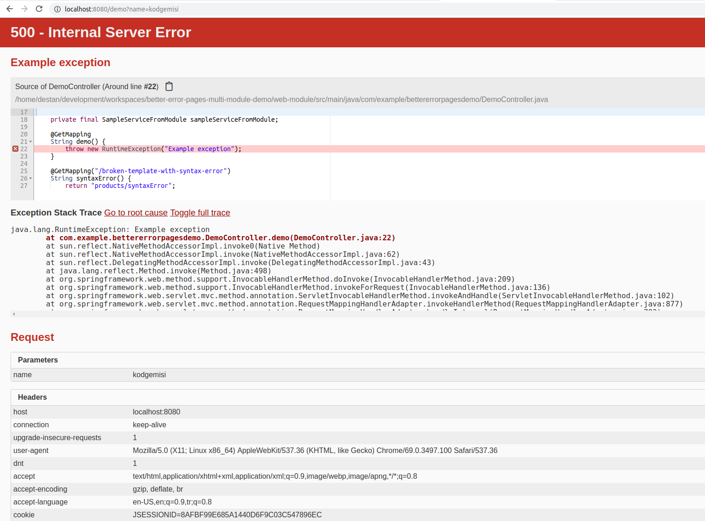
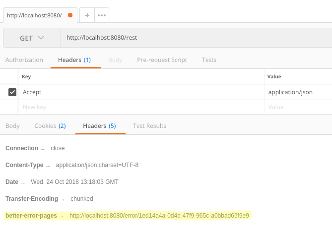
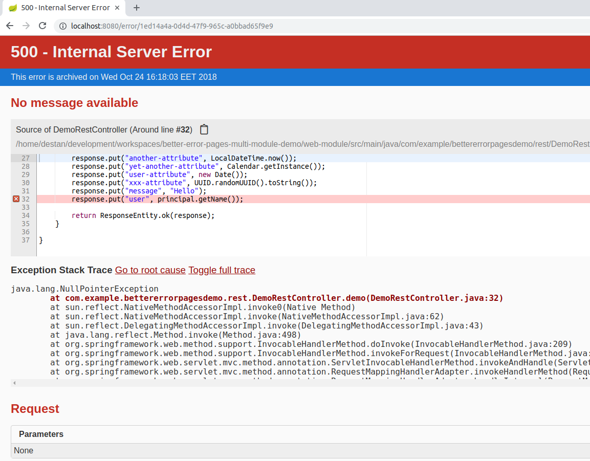

# Better Error Pages

[](https://travis-ci.com/kodgemisi/better-error-pages-spring-boot-starter)
[](https://jitpack.io/#kodgemisi/better-error-pages-spring-boot-starter)


This is a `Spring Boot Starter` project which provides Rails like error pages for Spring Boot applications for development environments.



For **rest requests**, any error is archived until a configurable `timeout` and the error page url is sent in rest request's response headers.





## Demo

https://better-error-pages-demo.herokuapp.com

Note that demo page is a Heroku app so it may be sleeping when you first open the page, it may take 1-2 min for server to wake up.

## Quick Start

Just add the dependency to your maven/gradle of your Spring Boot application then it will autoconfigure itself and
_Better Error Pages_ will be available if your active profiles includes `dev` or `development`.

It is assumed that you are already using **thymeleaf** as template engine.

**Adding the dependency to your project**

```xml
<dependencies>
  <dependency>
    <groupId>com.github.kodgemisi</groupId>
    <artifactId>better-error-pages-spring-boot-starter</artifactId>
    <version>${better-error-pages-spring-boot-starter.version}</version>
  </dependency>
</dependencies>

<repositories>
  <repository>
    <id>jitpack.io</id>
    <url>https://jitpack.io</url>
  </repository>
</repositories>
```

See https://jitpack.io/#kodgemisi/better-error-pages-spring-boot-starter for Jitpack usage, dependency details, version info and Gradle usage.

## Configuration

Better Error Pages;

* sets `server.error.include-stacktrace: always` and `server.error.include-exception: true` automatically.
* autoconfigures itself if active profile has `dev` or `development` however you can override this via `better-error-pages.profiles` property.
* finds your `@SpringBootApplication` annotated class and use its package name as `better-error-pages.package-name` name however you can override this via `better-error-pages.package-name` property.

<span style="color: darkorange;font-weight: bold;">⚠</span>
Setting `better-error-pages.package-name` property improves startup performance significantly but won't affect runtime performance.

<span style="color: darkorange;font-weight: bold;">⚠</span>
If you set `better-error-pages.package-name` property then your project must have **one of** following files:

* application.yml
* application-dev.yml
* application.properties
* application-dev.properties

<span style="color: blue;font-weight: bold;">🛈</span>
Note that `package-name` should be typically your own base package which is used throughout your own classes like `com.yourcompany`.

```yaml
better-error-pages:
  package-name: <String> # A package name whose classes' source code will be parsed and displayed in error pages. Mandatory.
  profiles: <String or List of string> # Override default profiles to enable Better Error Pages. Default value: "dev, development"
```

## Limitations

* Won't work for package names containing upper case characters.
* Can't show source code in multi module projects only if the project is run as packaged but other features will work.
  * When running multi module projects from an IDE everything just works.

## Troubleshooting

### IllegalArgumentException: Could not resolve placeholder

`Caused by: java.lang.IllegalArgumentException: Could not resolve placeholder 'better-error-pages.package-name' in value "${better-error-pages.package-name}"`

 See Prerequisites, you need to set `better-error-pages.package-name` property.

 # LICENSE

 © Copyright 2018 Kod Gemisi Ltd.

 Mozilla Public License 2.0 (MPL-2.0)

 https://tldrlegal.com/license/mozilla-public-license-2.0-(mpl-2)

 MPL is a copyleft license that is easy to comply with. You must make the source code for any of your changes available under MPL, but you can combine the MPL software with proprietary code, as long as you keep the MPL code in separate files. Version 2.0 is, by default, compatible with LGPL and GPL version 2 or greater. You can distribute binaries under a proprietary license, as long as you make the source available under MPL.

 [See Full License Here](https://www.mozilla.org/en-US/MPL/2.0/)
